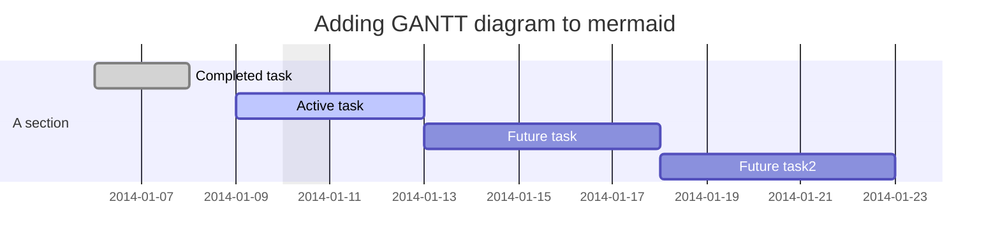
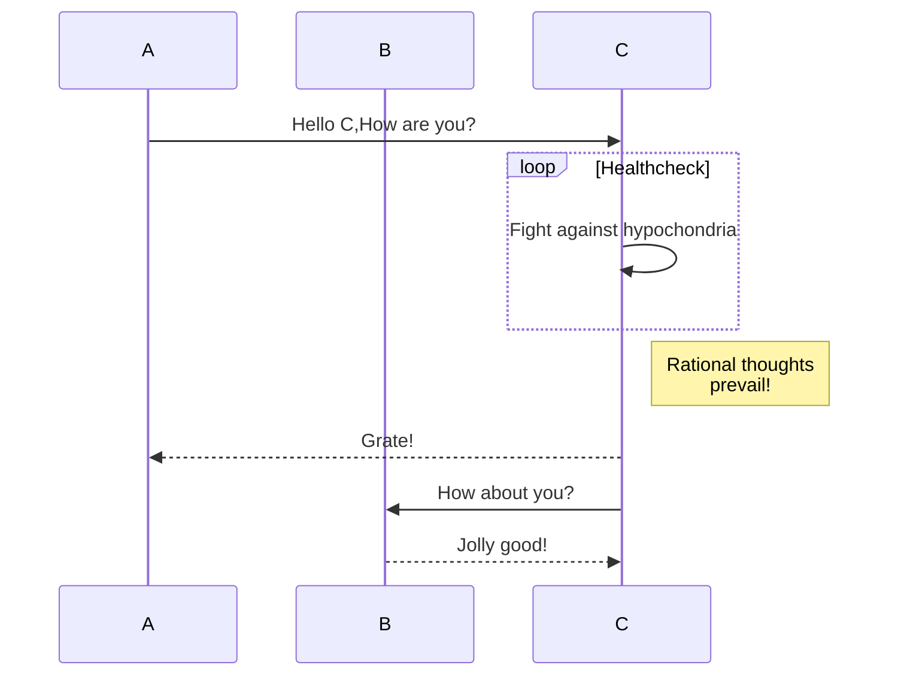
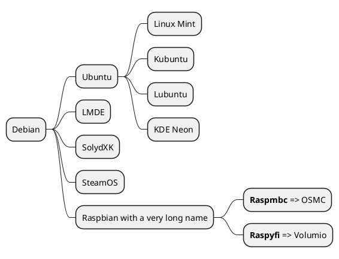

---
layout: cover
---

# PC基礎講習会
## Vol.1  
  
<v-click>

大阪公立大学工業高等専門学校　谷口　陽音

</v-click>

---
layout: intro
---

# 1. OSについて

---

# 1.1 OSとは

<v-clicks>

OS:コンピュータを使う上で**必ず**必要なソフトウェア  
OSの役割

</v-clicks>
<v-clicks>

- コンピュータの入出力制御(=IO)
- メモリの管理
- ファイルの管理
- PCのパフォーマンスの向上のための制御
- API(プログラム用のインターフェース)の提供
  
</v-clicks>
______

<v-clicks>

- OSにも様々な種類がある
- OSごとに実行(可能)ファイルが異なる

</v-clicks>

---

# 1.2 OSの例

PC

<v-clicks>

- WIndows
- MacOS
- ChromeOS
- Linux

</v-clicks>


スマートフォン・タブレット

<v-clicks>

- Android
- iOS
- iPadOS

</v-clicks>

サーバー

<v-clicks>

- Linux
- Windows Server

</v-clicks>

---

# 1.3 実行ファイル  

<v-clicks>

実行ファイル：そのOSで実行可能なファイル  
$$ シェルスクリプト \in 実行ファイル $$
ex:

</v-clicks>
<v-click>

OS|拡張子
--|--  
Windows|.exe/.msi
MacOS|.app/.ipa
Android|.apk
iOS/iPadOS|.ipa
Linux|.appdata/.sh

</v-click>

---

# 1.4 Windows

<v-click>

|項目|内容|
|---|---|
|開発元|Microsoft|
|種類|Windows,Windows Server|
|標準ブラウザ|Microsoft Edge|

</v-click>

特徴

<v-clicks>

- Windows Subsystem for LinuxでLinux環境を構築可能
- シェア率が極めて高い(70%以上)
- MSEdgeはChromium系でChrome拡張が使える

</v-clicks>

---

# 1.5 MacOS

<v-click>

|||
|--|--|
|開発元|Apple|
|種類|MacOS|
|標準ブラウザ|Safari|

</v-click>

特徴

<v-clicks>

- UNIX系でUNIXコマンドが実行可能
- Webなどに適している
- Appleデバイスとの連携が強い
- SafariはChromium系ではない

</v-clicks>

---

# 1.6 ChromeOS

<v-click>

|||
|--|--|
|開発元|Google|
|種類|ChromeOS/ChromeOS Flex/ChromiumOS|
|標準ブラウザ|Google Chrome|

</v-click>

特徴

<v-clicks>

- Webベース
- リソース消費量が少ない
- (正式版のみ)Androidアプリが使える

</v-clicks>

---

# 1.7 iOS/iPadOS

<v-click>

|||
|--|--|
|開発元|Apple|
|種類|iOS/iPadOS|
|標準ブラウザ|Safari|

</v-click>

特徴

<v-clicks>

- AppStore経由でしかアプリを入れられない
- アプリはMac以外では開発できない
- Apple製品との連携が強い

</v-clicks>

---

# 1.8 Android

<v-click>

|||
|--|--|
|開発元|Google|
|種類|Android/Android x86など|
|標準ブラウザ|Google Chrome/発売元独自ブラウザなど|

</v-click>

特徴

<v-clicks>

- Linuxベース
- 野良アプリ(Google Play Store経由以外のアプリ)のインストールができる
- 開発環境はWin/Mac/Linuxに対応

</v-clicks>

---

# 1.9 Linux
## 1.9.1 Linuxとは

<v-click>

|||
|--|--|
|開発者|Linus Torvaldsおよびその他コミュニティ|
|種類|狭義にはKernel,広義にはDistribution(Distributionは極めて多種多様)|
|標準ブラウザ|Firefox,Chromiumなど様々

</v-click>
<v-clicks>

- 「伝説的エンジニア」Linus Torvaldsが大学生のときに開発
- 昨今のWeb社会の構築に一役買っている
- OSS

</v-clicks>

---

## 1.9.2 KernelとDistribution

<v-click>

|||
|--|--|
|Kernel|OSの核|
|Distribution|様々な周辺ソフトを添付して配布されたもの|

</v-click>

Kernel

<v-clicks>

- OSの核にあたる部分
- 狭義のLinux
- Shellなどは自力インストールをすることが前提

</v-clicks>

Distribution

<v-clicks>

- LinuxはKernelのみでは動かない
- コミュニティによって開発
- 略して「ディストロ」

</v-clicks>

---

## 1.9.3 Distributionの分類

<v-click>

系統|特徴|パッケージマネージャー
--|--|--
Debian系|最も多くのディストロを擁する|apt
RedHat系|元となったディストロは商用シェアNo.1|rpm
Arch系|安定性が高く、コミュニティが活発|Pacman
独立系|上記の3つのいずれにも該当しない|ディストロによる|

</v-click>

---

## 1.9.4 ユーザーインターフェース

ユーザーインターフェース(=UI):コンピュータを扱うときに見る画面
- GUIとCLI
  
<v-clicks>
  
  - GUI(Graphical User Interface)
    - キーボード&マウス
  - CLI(Command Line Interface)=CUI(Character User Interface/Character-based User Interface/Command User Interface)
    - キーボードのみ
    - Shellを使う

</v-clicks>

---

## 1.9.5 シェル

<v-click>

シェル:コマンドの入力インターフェース兼コマンドの入力補助プログラム

</v-click>
<v-clicks>

- WindowsのコマンドプロンプトやPowerShellにあたる
- Linuxでは通常Bash

</v-clicks>

---

## 1.9.6 デスクトップ環境

<v-clicks>

デスクトップ環境(Desktop Environment = DE):GUIの環境

| | | |
|--|--|--|
|GNOME Shell|3D効果を駆使したグラフィカルなUI|GNU |
|KDE Plasma|美しく、モダンで高機能制なUI|KDE |
|Xfce|軽さと機能性を両立したスマートなUI| |
|LXDE/LXQt|軽さを追求したとにかく軽いUI| |
|Budgie|すっきりとした美しいデザインでモダンなUI| |

</v-clicks>

---

## 1.9.7 Linuxで利用するソフト

<v-clicks>

Linuxでも十分実用的なソフトがある  
=>クロス・プラットフォーム

</v-clicks>
<v-click>

ソフトウェア名|用途|類似ソフト
--|--|--
Inkscape|ベクターグラフィックス|Adobe Illustrator
GIMP|画像編集|Adobe Photoshop
Krita|ラスターグラフィックス|Clip Studio Paint
Microsoft Visual Studio Code|テキストエディタ|
GitHub Desktop|Git管理|
Figma|UI設計|

</v-click>

---

## 1.9.8 コマンドライン・ツール

<v-click>

コマンドライン・ツール:コマンド上から実行するツール

</v-click>
<v-clicks>

- Vim/NeoVim
- git
- GitHub CLI
- LilyPond
- Windows File Recovery
- LaTeX

</v-clicks>

---

# 1.10 まとめ

<v-clicks>

- OSはコンピュータの動作に不可欠
- 一口にOSといっても様々な種類がある
- UIはGUIとCUIの2つに大別される
- 本プロジェクトでは基本的にOSSかつプラットフォームを利用する

</v-clicks>

---
layout: intro
---

# 2. ソフトウェアについて

---

# 2.1 ソフトウェアとは

<v-click>

- ソフトウェア(中学技術)

</v-click>
<v-clicks>

  - 基本ソフトウェア(OS)
  - 応用ソフトウェア(アプリケーション)

</v-clicks>
<v-click>

ここでは、応用ソフトウェアにフォーカスする

</v-click>

---

# 2.2 ソフトウェアの構成と作成方法

<v-clicks>

- ソフトウェア=プログラム+ライブラリ+バイナリファイル+...
- 次の手順で作成する

</v-clicks>
<v-clicks>

  - 計画
  - プログラミング
  - コンパイル
  - ビルド
  - 配布

</v-clicks>
<v-click>

以下ではプログラミングにフォーカスする

</v-click>

---

# 2.3 プログラミングとは

<v-clicks>

- プログラミング=コンピュータへの命令を書いたファイルの作成
- $$ シェルスクリプト \in プログラム $$

</v-clicks>

---

# 2.4 プログラミング言語
プログラミング言語

<v-clicks>

- コンパイラ言語
- スクリプト言語

</v-clicks>
<v-click>

ここでは主にスクリプト言語を扱う

</v-click>


## 2.4.1 このプロジェクトで扱うプログラミング言語

<v-click>

- 本プロジェクトはWeb系だから自ずと利用言語は限られる

</v-click>

---

## 2.4.2 JavaScript

<v-clicks>

- スクリプト言語
- 主にWeb
- Node.JS,ElectronでPC向けアプリも作れる

</v-clicks>
<v-click>

```javascript{all|2|3|4-8|9}
//sample.js
let age = 15;
Console.log("Hello,World!")
if age <= 18{
    Alert("成人です")
}else{
    Alert("未成年です")
};
document.getElementByID("AGE").innerText = age;
```

</v-click>

---

## 2.4.3 Python

<v-clicks>

- スクリプト言語
- 様々なことに使われる
  - サーバーサイドプログラム
  - AI
- インデントが意味を持つ

</v-clicks>
<v-click>

```python{all|2|3|4-7|8}
#sample.py
age = 15;
print("Hello,World")
if age <= 18:
    print("成人です")
else:
    print("未成年です")
print(age)
```

</v-click>

---

# 2.4.4 PHP

<v-clicks>

- スクリプト言語
- Web開発
- 今回はJSに統一予定
- サーバーサイド

</v-clicks>
<v-click>

```php{all|2|3|4-8}
//sample.php
$age = 15;
echo 'Hello, World!';
if ($age >= 18){
    echo "成人です";
}else{
    echo "未成年です";
}
```

</v-click>

---

## 2.4.5 HTML/CSS

<v-clicks>

- Webページの見た目と要素を設定
- 正確にはプログラミング言語ではない

</v-clicks>
<v-clicks>

  - HTML(Hyper Text *Markup Language*):マークアップ言語
  - CSS(Cascading *Style Sheets*):スタイルシート

</v-clicks>
<v-click>

```html{all|2|3-14|4-8|9-13|7|12}
<!--sample.html-->
<!DOCTYPE html>
<html>
    <head>
        <meta charset=utf-8>
        <title>sample page</title>
        <link rel="stylesheet" href="sample.css">
    </head>
    <body>
        <p class=midashi>Hello,World!</p>
        <p class=age>年齢:<span id="AGE"></span></p>
        <script src="sample.js"></script>
    </body>
</html>
```

</v-click>

---

<v-click>

```css{all|2-6|7-11|12-15|3,8,13|4,9|5,10}
/*sample.
css*/
.midashi{
    font-size: 20pt;
    color: navy;
    border-bottom: 2px solid;
}
.age{
    font-size: 18pt;
    color: red;
    border-bottom: 2px dashed;
}
#AGE{
    font-size:22pt
}
```

</v-click>

---

# 2.5 実際にアプリケーション作成によくつかわれｑ言語

OSによって異なるためOSごとに記述する

---

## 2.5.1 Windows

<v-clicks>

- 自由度はわりと高い
- 主にMicrosoft製のC#が使われる
- C#はC言語系でC++およびJavaの派生
- C#以外だとVisual Basic,Java,JavaScript,C++など
- C#,C++,VBなどは方言がある

</v-clicks>
<v-click>

```cs{all|2|3-13|4|5|6-10|6-8|8-10|11}
//sample.cs
using system;
public static void main{
    int age = 15;
    console.writeLine("Hello,World");
    if(age <= 18){
        console.writeLine("成人です");
    } else{
        console.writeLine("未成年です");
    };
    console.writeLine(age);
}
```

</v-click>

---

## 2.5.2 MacOS,iOS,iPadOS

<v-clicks>

- 原則SwiftまたはObjective-c系
- IDEはXCode
- Macでしか開発できない(Macは例外的にJavaも動かせる)
- UnityなどでWindowsでビルドできるがMacでリビルドしなければ動かない

</v-clicks>
<v-click>

```swift{all|2|3|4-7|5|7|8}
//sample.swift
var age: Int = 15;
print("Hello,World!");
if age >= 18
    print("成人です");
else
    print("未成年です");
print(age);
```

</v-click>

---

## 2.5.3 Android

<v-clicks>

- Kotlinが推奨されている
- 少し前まではJava
- IDEのAndroid StudioはJetBrains IntelliJ IDEA Communityベース
- Android Studioはクロスプラットフォーム

</v-clicks>
<v-click>

```kotlin{all|3|4|5-9|5-7|7-9}
//sample.kt
fun main (args:string){
    int age = 15;
    println("Hello,World!")
    if (age >= 18){
        println("成人です")
    }else{
        println("未成年です")
    }
}
```

</v-click>

---
layout: intro
---

# 3. Markdown

---

# はじめに

本プロジェクトの標準ドキュメント形式

<v-clicks>

- Markdown
- LaTeX

</v-clicks>
<v-click>

よって、皆さんにはMarkdownを扱えるようになってもらう

</v-click>

---

# 3.1 Markdownとは

<v-clicks>

- 軽量マークアップ言語の一つ
- Markdownの活用例

</v-clicks>
<v-click>

  - エンジニア向けツール

</v-click>
<v-clicks>

    - Qiita
    - Zenn
    - GitHub

</v-clicks>
<v-clicks>

  - プレーンテキストを少しの記号で見やすくする
  - メモとして使用する

</v-clicks>

---

# 3.2 MarkdownとHTML

<v-clicks>

- MarkdownとHTML間には互換性がある
- そもそもMarkdownはHTMLを簡略化したもの
- Markdownで実装されなかった部分はHTMLタグで記述

</v-clicks>
<v-click>

Markdown<=>HTMLの互換性は高い

</v-click>

---

# 3.3 Mermaid

<v-clicks>

一部のMarkdownエンジンではMermaidを使える  
Mermaidは以下のような図をかけるエンジン

</v-clicks>
<v-clicks>

- フローチャート
- シーケンス図
- ガントチャート
- クラス図
- Gitグラフ
- ER図
- ジャーニーマップ
- クアドラントチャート

</v-clicks>

---
layout: two-cols
---

<template v-slot:default>

<v-click>

### フローチャート

</v-click>
<v-click>


</v-click>
<v-click>

### ガントチャート

</v-click>
<v-click>



</v-click>

</template>

<template v-slot:right>

<v-click>

### クラス図

</v-click>
<v-click>



</v-click>

</template>

---

<v-click>

# 3.4 PlantUML

</v-click>
<v-click>

- Mermaidの様なグラフ作成ツール

</v-click>
<v-clicks>

  - シーケンス図
  - ユースケース図
  - クラス図
  - オブジェクト図
  - アクティビティ図
  - コンポーネント図
  - 配置図
  - 状態遷移図
  - タイミング図
  - ガントチャート
  - マインドマップ
  - ER図
  - 数式

</v-clicks>

---

<v-click>

### マインドマップ

</v-click>
<v-click>



</v-click>

---

# 3.5 記法

<v-click>

Markdown=>記号を用いて構造化

</v-click>

---

## 3.5.1 見出し

<v-clicks>

- 第1レベル(大)~第6レベル(小)
- HTMLとの互換性あり

</v-clicks>
<v-click>

```markdown
# 第1レベル
## 第2レベル
### 第3レベル
#### 第4レベル
##### 第5レベル
###### 第6レベル
```

</v-click>
<v-click>

- 出力


# 第1レベル
## 第2レベル
### 第3レベル
#### 第4レベル
##### 第5レベル
###### 第6レベル
(本文)

</v-click>

---

## 3.5.2 箇条書き

<v-click>

非常に簡単

</v-click>
<v-click>

```markdown
- 箇条書き
* これでも可
+ これもOK
    - ネストも可能
```

</v-click>
<v-click>

- 箇条書き
* これでも可
+ これもOK
    - ネストも可能

</v-click>

---

## 3.5.3 番号付きリスト

<v-click>

番号付きリストも可能

</v-click>
<v-click>

```markdown
1. 1つ目
2. 2つ目
1. 番号は何でもいい
    1. ネストも可能
    3. 番号がとんでもOK
```

</v-click>
<v-click>

1. 1つ目
2. 2つ目
1. 番号は何でもいい
    1. ネストも可能
    3. 番号がとんでもOK

</v-click>

---

## 3.5.4 表

<v-click>

表も割りと簡単に作れる

</v-click>
<v-click>

```markdown
| 列1 | 列2 | 列3 | 列4 |
| --- | :--- | :---: | ---: |
| デフォルト | 左詰め | 中揃え | 右詰め |
| 1 | 2 | 3 | 4 |
```

</v-click>
<v-click>

| 列1 | 列2 | 列3 | 列4 |
| --- | :--- | :---: | ---: |
| デフォルト | 左詰め | 中揃え | 右詰め |
| 1 | 2 | 3 | 4 |

</v-click>

---

# 3.6 拡張子

<v-click>

- Markdownの拡張子は以下の2種類

</v-click>
<v-clicks>

  - .md
  - .markdown

</v-clicks>

---
layout: intro
---

# 4. コマンド操作とGit

---

# 4.1 コマンドと引数

<v-clicks>

- コマンド:特定の文字列を利用してPCを制御する
- コマンドのあとにつける対象などの文字列を**引数**という
- 引数の読み方は**ひきすう**(数学の因数と区別するため)
- コマンドのあとにつける文字列には以下の種類がある

</v-clicks>
<v-clicks>

  - 引数
  - サブコマンド
  - コマンドオプション

</v-clicks>

# 4.2 基本コマンド

<v-click>

PowerShell上、およびMac,Linuxで使用できるコマンド

</v-click>

---

## 4.2.1 ls

<v-clicks>

- ls:カレントディレクトリ以下のファイル・ディレクトリを一覧表示
- LiSt
- 対象ディレクトリを引数にとることができる

</v-clicks>

## 4.2.2 pwd

<v-clicks>

- pwd:カレントディレクトリのパスを表示
- Print Working Directory

</v-clicks>

---

## 4.2.3 mkdir

<v-clicks>

- mkdir:カレントディレクトリ直下にディレクトリ作成
- MaKe DIRectory
- 作成先ディレクトリを引数にとることができる

</v-clicks>

## 4.2.4 cd

<v-clicks>

- cd:カレントディレクトリの移動
- Change Directory
- 移動先ディレクトリを引数にとる

</v-clicks>

---

# 4.3 gitのセットアップ
## 4.3.1 git config

<v-clicks>

Gitをインストールしたあとには設定が必要  
以下にそのときのGitコマンドを示す

</v-clicks>
<v-click>

```git{all|1|2}
git config --global user.email <mail>
git config --global user.name <name>
```

</v-click>
<v-clicks>

以上のコマンドの役割
コミットする際に必要な以下の情報の設定

</v-clicks>
<v-clicks>

  - ユーザー名
  - メールアドレス

</v-clicks>

---

## 4.3.2 git clone

<v-clicks>

- リモートリポジトリをローカルリポジトリにクローンする
- Gitで一番基本的
- Gitを始めるために必要

</v-clicks>
<v-click>

```git{1|2}
git clone <URL>
git clone https://github.com/haru-0205/markdown
```

</v-click>

---
layout: intro
---

# 5. 次回について

---

<v-click>

次回は以下のことを行う

</v-click>
<v-clicks>

- 今回のコマンドの続き(実際にいくつかコマンドを実行)
- Markdownの続き
- ハードウェアについて

</v-clicks>

<v-click>

それにともない、Wingetが必要だからインストールしておくこと。

</v-click>

---

<v-click>

次回導入するソフトウェア(まだインストールしなくてよい)

</v-click>
<v-clicks>

- Obsidian
- GitHub CLI
- ImageMagic
- GitKraken

</v-clicks>
<v-click>

また、次回の講習ではGitHubアカウントが必要だから準備しておくこと

</v-click>
